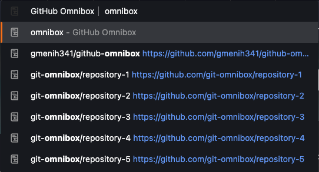
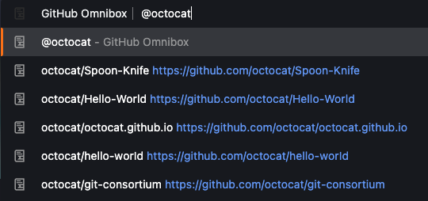
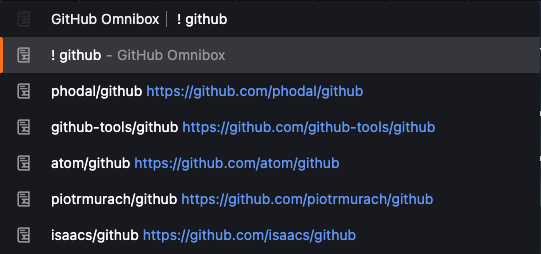
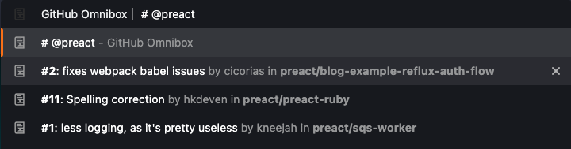

# Github Omnibox

_Github Omnibox_ is a simple browser extension that brings GitHub search into the omnibox (_that's the URL bar in your browser_). Its main feature is giving you instant suggestions of any repository you are a member of, making access to them super fast. It also supports simple queries via GitHub's API, to find specific repositories or pull requests.

It binds the `gh` keyword in omnibox. Any text entered after it will be used to make the search.

## Features

By default, _GitHub Omnibox_ will search in its internal cache and try to make the best suggestion based on your query. This cache only includes repositories you are member of, so in order to support wider search results, a few special queries exist, which will always query GitHub's API to find results.

* **Global API search** - using `!` in your query will make a _global_ search in GitHub and show matching results.
* **Scoped API search** - using `@<user>` will scope search results to a specific user or organization. _(E.g.: `@octocat` would only return repositories owned by octocat)_
* **Pull request search** - using `#` will search for pull requests instead of repositories. 

## Preview

_Quick search_

_Searching for repositories owned by `@octocat`_

_Performing a global search_

_Searching for pull requests scoped to `@preact`_

## Download

For now, look for recent builds in Actions. Chrome and Firefox store coming up soon.

## Contributing

Any issues, suggestions and pull requests are more than welcome!
